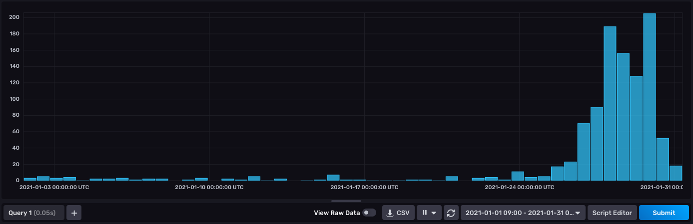

# Reddit activity tracker

This is a repository that was set up with the idea of monitoring new users' activity in light of the events in the `wallstreetbets` subreddit. The script will scrape posts within the dates provided (used as _from_ and _to_ date limits for old posts) and store only the users' information that are newer than the compared date provided (the default date is set us 2021-01-01). This process stores the `comment_id` and `created_utc` parameter of a redditor's account on influxdb.  

An example that highlights the higher activity of **new** users (created after 01-01-2021) on WSB leading to the end of January can be seen below (from influxdbv2):

This shows the high activity of new users on the dates leading to GME, AMC

The project consists of:
   * `influxdbv2` (as the database)
   * `praw` (for the reddit API) 

### Setting up the project

1. Run `pip install -r requirements.txt`
2. For influxdb run `docker-compose up -d` (it should run in port 8086) 

### Running the project

`python main.py` 

The p (if not changed) will scrape January 2021 posts from `wallstreetbets` and log the dates of the

#### Requirements

1. Influxdb configuration more info [here](https://github.com/influxdata/influxdb-client-python#client-configuration) and specifically at providing an `*.ini` file.
2. [Registering](https://github.com/reddit-archive/reddit/wiki/OAuth2-Quick-Start-Example#first-steps) a bot and configuring it with a praw.ini (not provided) file. More info [here](https://praw.readthedocs.io/en/latest/getting_started/configuration/prawini.html)
